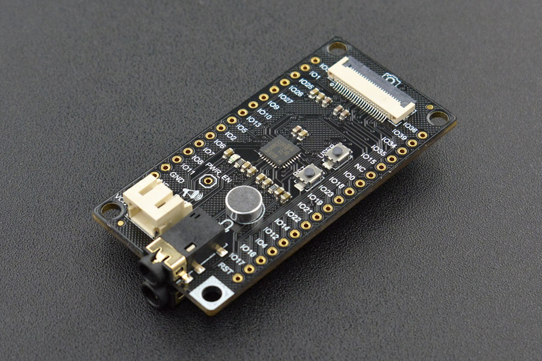

# DFRobot_IIS
- [中文版](./README_CN.md)

Provides an Arduino library for FireBeetle Covers-Camera&Audio Media Board 



## Product Link（https://www.dfrobot.com/product-1720.html）

    DFR0498：FireBeetle Covers-Camera&Audio Media Board

## Table of Contents

* [Summary](#summary)
* [Installation](#installation)
* [Methods](#methods)
* [Compatibility](#compatibility)
* [History](#history)
* [Credits](#credits)

## Summary

The library is used to Play music file from SD card,Record sound and save in SD card,take photo and save in SD card
## Installation

To use this library, download the library file and paste it into the \Arduino\ Libraries directory, then open the examples folder and run the demo in that folder.


## Methods

```C++

  /**
   * @fn init
   * @brief Init function
   * @details Initialize I2S mode, I2S can be used as audio and camera controller in esp32
   * @param mode I2S mode, AUDIO or CAMERA 
   * @return Data of bool type
   * @retval true Init succeeded
   * @retval false Init failed
   */
  bool init(uint8_t mode);

  /**
   * @fn SDCardInit
   * @brief Mount SD card
   * @return Data of bool type
   * @retval true Init succeeded
   * @retval false Init failed
   */
  bool SDCardInit(void);

  /**
   * @fn sendPhoto
   * @brief Send out the photo obtained from the camera via network
   */
  void sendPhoto(void);

  /**
   * @fn setSpeakersVolume
   * @brief Set speakers volume
   * @param volume Volume, range 0-99
   */
  void setSpeakersVolume(uint8_t volume);
  
  /**
   * @fn muteSpeakers
   * @brief Mute speakers
   */
  void muteSpeakers(void);

  /**
   * @fn setHeadphonesVolume
   * @brief Set headphones volume
   * @param volume Volume, range 0-99
   */
  void setHeadphonesVolume(uint8_t volume);
  
  /**
   * @fn muteHeadphones
   * @brief Mute headphones
   */
  void muteHeadphones(void);
  
  /**
   * @fn setFreamsize
   * @brief Set camera pixel
   * @param photoSize  optional (QQVGA,QQVGA2,QICF,HQVGA,QVGA,RGB555,GRAYSCALE)
   * @return Return the set pixel
   */
  uint8_t setFreamsize(uint8_t photoSize);

  /**
   * @fn setPixformat
   * @brief Set color depth
   * @param pixelFormat  RGB555(RGB565 true color), GRAYSCALE(grayscale image)
   * @return Return the set color depth
   */
  uint8_t setPixformat(uint8_t pixelFormat);

  /**
   * @fn snapshot
   * @brief Take photo
   * @param pictureFilename The name of the file to save picture
   */ 
  void snapshot(const char *pictureFilename);
  
  /**
   * @fn connectNet
   * @brief Connect to WIFI
   * @param ssid     WIFI name
   * @param password WIFI password
   */ 
  void connectNet(const char* ssid,const char* password);

  /**
   * @fn initPlayer
   * @brief init music player
   */
  void initPlayer();
  
  /**
   * @fn initRecorder
   * @brief Init recorder
   */
  void initRecorder();

  /**
   * @fn playMusic
   * @brief Play music
   * @param filename The name of the file used to play
   */
  void playMusic(const char *Filename);

  /**
   * @fn record
   * @brief record sound
   * @param filename he name of the file to save record
   */
  void record(const char *Filename);

  /**
   * @fn playerControl
   * @brief Control the music player
   * @param cmd Command to control music player
   * @n    PLAY   Begin or continue play music
   * @n    PAUSE  Pause play music
   * @n    STOP   Stop play music
   */
  void playerControl(uint8_t cmd);

  /**
   * @fn recorderControl
   * @brief Control the recorder
   * @param cmd Command to control recorder
   * @n   BEGIN  Begin recording
   * @n   STOP   Stop recording
   */
  void recorderControl(uint8_t cmd);
  
  /**
   * @fn SDcard_Init
   * @brief Initialize SD card
   * @param mountpoint SD card name
   */
  bool SDcard_Init(const char* mountpoint="/sdcard");

```

## Compatibility

MCU                | Work Well | Work Wrong | Untested  | Remarks
------------------ | :----------: | :----------: | :---------: | -----
FireBeetle-ESP32  |      √       |             |            | 
FireBeetle-ESP8266  |             |      √       |            | 
FireBeetle-BLE4.1 |             |       √      |            | 

## History

- 2017/9/29 - Version 1.0.0 released.
- 2022/3/21 - Version 1.0.1 released.
## Credits

Written by fengli(li.feng@dfrobot.com), 2022.3.21 (Welcome to our [website](https://www.dfrobot.com/))
